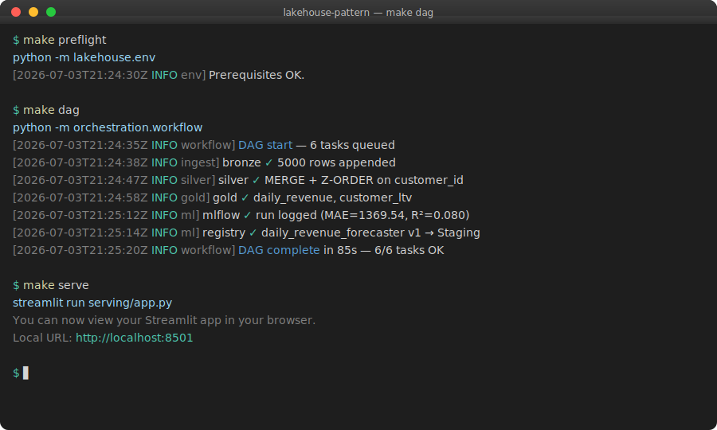
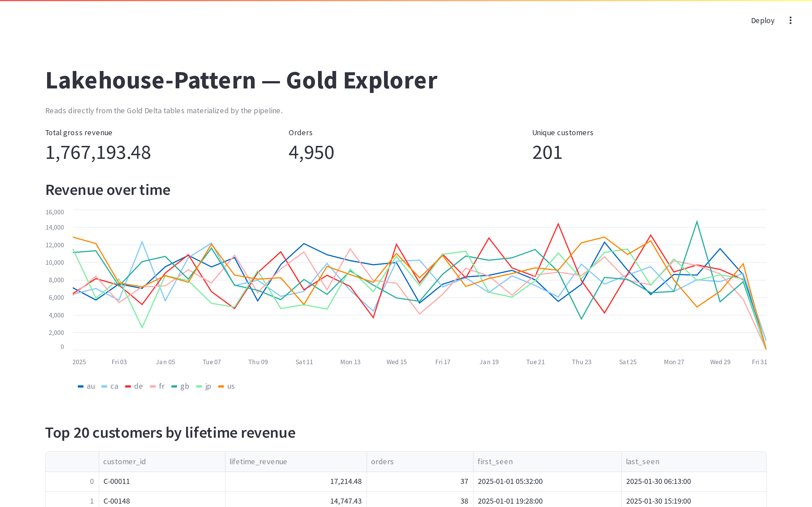
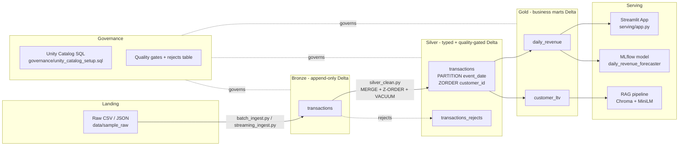

# Lakehouse-Pattern

> A reference implementation of the Databricks lakehouse architecture — medallion tables, Delta Lake, MLflow, and a RAG demo — that runs entirely on open-source tooling.

[](https://github.com/TylrDn/Lakehouse-Pattern/actions/workflows/ci.yml)
[](https://tylrdn.github.io/Lakehouse-Pattern/)
[](https://github.com/TylrDn/Lakehouse-Pattern/releases)
[](LICENSE)
[](https://www.python.org/downloads/)
[](https://adoptium.net/temurin/releases/?version=17)
[](https://github.com/astral-sh/ruff)
[](.pre-commit-config.yaml)

<p align="center">
  
</p>

## What you get

<p align="center">
  
</p>

A reproducible Bronze → Silver → Gold pipeline that ends in an interactive
Streamlit dashboard, a registered MLflow model, and a working RAG assistant
— all runnable locally with a single `make dag` after `make preflight`.

## Business problem

A retail team needs a single system that ingests raw transactional feeds,
serves cleansed data to analysts, powers a forecasting model, and grounds a
customer-facing RAG assistant — with governance, lineage, and reproducible
CI. A **warehouse** solves the BI half but forces expensive ETL for ML and
can't hold unstructured data. A **plain data lake** solves the ML half but
lacks ACID, schema enforcement, and governance. A **lakehouse** — Delta Lake
on object storage with Spark compute — gives us both, at a lower cost profile
than either alternative because storage and compute are decoupled and priced
independently.

This repo implements that lakehouse end-to-end.

## Architecture



Full narrative in [`docs/architecture.md`](docs/architecture.md). Table-level
and column-level lineage in [`docs/lineage.md`](docs/lineage.md).

## Tech stack

| Concern | Choice | Why |
| --- | --- | --- |
| Storage format | **Delta Lake 3.2** | ACID, schema enforcement/evolution, MERGE, time travel, OPTIMIZE/Z-ORDER |
| Compute | **PySpark 3.5** | Same DataFrame API as Databricks runtime |
| Streaming ingest | **Structured Streaming** | 1:1 conceptual match to Databricks Auto Loader |
| Declarative pipeline | **Custom OSS analog** | DLT is closed-source; the pattern is portable |
| Data quality | **Custom `Expectation` DSL + pytest** | Mirrors DLT expectations without the vendor lock-in |
| ML | **MLflow 2.14** | Tracking + registry; same API on Databricks |
| RAG | **chromadb + sentence-transformers** | All-OSS; swaps 1:1 with Databricks Vector Search |
| Serving | **Streamlit** | Databricks Apps analog; runs unchanged on the platform |
| Orchestration | **Custom DAG runner** | Databricks Workflows analog with retry semantics |
| Governance | **Unity Catalog SQL script** | Runnable on paid tiers; documented for OSS |
| CI | **GitHub Actions** | ruff + pytest on every push/PR |

## Design decisions & tradeoffs

**Why Delta over vanilla Parquet.** Plain Parquet on object storage has no
concurrency control — two writers racing on the same table can silently
corrupt it. Delta's transaction log (`_delta_log`) gives us ACID for free,
plus MERGE, schema enforcement, and time travel. The cost is a small write
overhead and an extra dependency; the correctness benefit is worth it every
single time.

**Why medallion.** Splitting into Bronze/Silver/Gold means each layer has one
job and one contract. Bronze is our replayable source of truth. Silver is
the trusted, deduped, typed table. Gold is business-shaped. When something
looks wrong downstream, you can walk the layers backward and pinpoint where
the discrepancy entered — impossible in a monolithic ETL.

**Why these quality gates.** We chose *quarantine* over *fail-fast* at
Silver. A single malformed row shouldn't kill the batch, and silently
dropping it destroys evidence. The `transactions_rejects` Delta table is
append-only and auditable — bad rows are visible without contaminating
Silver. On Databricks this pattern maps directly to DLT's `expect_or_drop`
with a rescued-data column.

**Why partition by `event_date` and Z-ORDER by `customer_id`.** Partitioning
should be low-cardinality and always in filter predicates; `event_date` fits
both. Z-ORDER should be high-cardinality and frequently filtered; `customer_id`
fits both. Doing them the other way round (partition by customer, cluster by
date) is a canonical mistake — it produces millions of tiny partitions.

**What I'd change at production scale.**
- Move OPTIMIZE + VACUUM to a scheduled maintenance job rather than running
  in-pipeline. In-pipeline is fine for a demo; in prod it lengthens the
  critical path.
- Replace the custom DAG runner with Databricks Workflows or Airflow —
  cluster reuse and alerting are not worth reinventing.
- Register Gold as materialized views under Unity Catalog rather than
  overwriting Delta paths.
- Add a merge-schema *contract* at Bronze so upstream feed changes trigger a
  design review rather than silent evolution.

**Cost implications.**
- Decoupled storage/compute means we pay compute only during job runs. A
  serverless SQL warehouse further slices this by scaling to zero between
  queries — huge win for spiky BI workloads over a Gold table.
- Delta's file-level statistics + Z-ORDER can turn multi-GB scans into
  100-MB reads for point queries — the difference between a $0.10 query and
  a $10 query at scale.
- Time travel is not free: keeping 30 days of history means storing 30 days
  of tombstoned files. `VACUUM RETAIN` is where you tune the tradeoff.

## Quickstart

Three ways to run everything, in order of least friction:

1. [GitHub Codespaces / VS Code Dev Containers](#option-1-codespaces--dev-container-zero-local-install) — zero local install.
2. [Docker Compose](#option-2-docker-compose-one-command-stack) — one command for the full stack.
3. [Local venv](#option-3-local-venv) — fastest inner loop for development.

### Option 1: Codespaces / Dev Container (zero local install)

On the repo page click **Code → Codespaces → Create codespace on main**, or open
the folder in VS Code and pick **Reopen in Container**. The devcontainer
provisions Python 3.11 + Java 17, runs `make setup && make preflight`
automatically, and forwards ports **8501** (Streamlit), **5000** (MLflow), and
**8000** (docs).

### Option 2: Docker Compose (one-command stack)

```bash
docker compose run --rm app make pipeline   # bronze -> silver -> gold
docker compose up -d mlflow streamlit       # MLflow UI + Streamlit gold explorer
# open http://localhost:5000  and  http://localhost:8501
```

All three services share a bind-mount of the repo and a named `mlruns` volume,
so Delta tables written by `app` show up immediately in the Streamlit UI and
MLflow runs show up in the tracking server.

### Option 3: Local venv

```bash
# 1. Clone + install
git clone https://github.com/TylrDn/Lakehouse-Pattern.git
cd Lakehouse-Pattern
python -m venv .venv && source .venv/bin/activate
make setup

# 2. Verify prerequisites (Java 17+ on PATH)
make preflight

# 3. Generate the sample data + run the full ETL DAG
make pipeline          # data → bronze → silver → gold, with retries

# 4. Train + register the ML model
make ml

# 5. Build the RAG index and ask a question
make rag

# 6. Launch the BI app
make serve             # http://localhost:8501

# 7. Run tests + linter
make ci
```

Java 17 is required for PySpark 3.5 — install via `brew install openjdk@17`
(macOS) or `apt install openjdk-17-jre` (Debian/Ubuntu). `make preflight`
will tell you if it's missing.

Prefer a scrollable notebook to a Makefile? Open
[`notebooks/01_lakehouse_walkthrough.ipynb`](notebooks/01_lakehouse_walkthrough.ipynb).

Want reproducible pipeline timings? See [`benchmarks/`](benchmarks/).

Stuck? See [`TROUBLESHOOTING.md`](TROUBLESHOOTING.md) or the full
[docs site](https://tylrdn.github.io/Lakehouse-Pattern/).

### Databricks Community Edition (free tier)

Community Edition gives you a single 6-hour cluster with Delta Lake enabled.
Unity Catalog and DLT are **not** available on Community Edition; use the
Hive Metastore + Workflows instead.

1. Sign up at [community.cloud.databricks.com](https://community.cloud.databricks.com/).
2. Create a cluster (Runtime 15.x LTS or newer).
3. Upload this repo via the Repos UI (or `databricks repos create`).
4. Open a notebook, set:

   ```python
   %pip install -r requirements.txt
   import os; os.environ["LAKEHOUSE_ROOT"] = "/dbfs/tmp/lakehouse-pattern"
   ```

5. Run the modules in order:

   ```python
   from data.sample_raw.download import main as dl; dl()
   from ingestion.batch_ingest import run as bronze; bronze()
   from transform.silver_clean import run as silver; silver()
   from transform.gold_aggregate import run as gold; gold()
   from ml.train_model import train; train(200, 8)
   ```

   The MLflow UI is at your workspace's `#mlflow` sidebar.

6. For governance (UC), you need a paid Premium workspace — the SQL in
   `governance/unity_catalog_setup.sql` is annotated with what to substitute.

## Repo walkthrough

| Folder | What it demonstrates |
| --- | --- |
| `data/sample_raw/` | Deterministic synthetic dataset loader + rationale for the choice |
| `ingestion/` | Batch (`batch_ingest.py`) and Structured Streaming (`streaming_ingest.py`) writes into Bronze Delta |
| `transform/` | Silver cleansing with MERGE, quality gates, OPTIMIZE + Z-ORDER + VACUUM; Gold marts |
| `pipelines/` | DLT-style declarative pipeline with an `Expectation` DSL |
| `governance/` | Full Unity Catalog SQL: catalogs, schemas, tags, grants, RLS, column masking, lineage |
| `ml/` | MLflow tracking (`train_model.py`), Model Registry (`register_model.py`), OSS RAG (`rag_demo/`) |
| `serving/` | Streamlit gold-layer explorer — Databricks Apps analog |
| `orchestration/` | DAG runner with retry semantics — Databricks Workflows analog |
| `tests/` | Unit tests + end-to-end data-quality tests + Delta-feature sanity tests |
| `docs/` | `architecture.md` deep-dive + `concept-coverage.md` traceability matrix |
| `.github/workflows/` | CI: ruff + pytest on every push/PR |

## Databricks concept coverage

| Concept | Status | Proof |
| --- | --- | --- |
| Medallion architecture | ✅ Implemented | `ingestion/`, `transform/` |
| Delta ACID | ✅ Implemented | All writes; `tests/test_delta_features.py` |
| Delta schema enforcement | ✅ Implemented | `lakehouse/schemas.py`, `test_schema_enforcement_rejects_bad_write` |
| Delta schema evolution | ✅ Implemented | `ingestion/batch_ingest.py` `mergeSchema=true` |
| Delta MERGE | ✅ Implemented | `transform/silver_clean.py::_merge_upsert` |
| Delta time travel | ✅ Implemented | `tests/test_delta_features.py::test_time_travel_returns_earlier_snapshot` |
| OPTIMIZE + Z-ORDER | ✅ Implemented | `transform/silver_clean.py::_optimize_and_vacuum` |
| VACUUM | ✅ Implemented | Same file |
| Partitioning + tuning | ✅ Implemented | Silver partitioning + `spark.sql.shuffle.partitions` |
| Structured Streaming | ✅ Implemented | `ingestion/streaming_ingest.py` |
| Auto Loader (`cloudFiles`) | 📄 Documented | Docstring in `streaming_ingest.py`; identical code shape |
| Delta Live Tables | 🧩 OSS analog | `pipelines/declarative_pipeline.py` (with DLT code sample) |
| Databricks Workflows | 🧩 OSS analog | `orchestration/workflow.py` |
| Unity Catalog governance | 📄 Documented (runnable SQL) | `governance/unity_catalog_setup.sql` |
| UC tags + lineage | 📄 Documented | Same SQL file, §3 + §6 |
| Row-level security + column masking | 📄 Documented | Same SQL file, §5 |
| MLflow tracking | ✅ Implemented | `ml/train_model.py` |
| MLflow Model Registry | ✅ Implemented | `ml/register_model.py` |
| Databricks Model Serving | 📄 Documented extension | `register_model.py` docstring |
| RAG + vector index | ✅ Implemented (OSS) | `ml/rag_demo/rag_pipeline.py` |
| Databricks Apps | 🧩 OSS analog | `serving/app.py` (Streamlit) |
| AI/BI Genie (NL-to-SQL) | 🚧 Extension point | See roadmap |
| Lakebase / OLTP | 🚧 Extension point | See roadmap |
| Delta Sharing | 🚧 Extension point | See roadmap |
| Query federation | 🚧 Extension point | See roadmap |
| Serverless SQL | 📄 Documented cost impact | `docs/architecture.md#cost-model` |

Legend: ✅ implemented • 🧩 OSS analog for a closed-source Databricks
feature • 📄 documented (runnable on paid Databricks) • 🚧 clearly-scoped
extension point.

## Roadmap / extension points

Each of these is deliberately out of scope for this repo, but I have a design
sketch for each — happy to whiteboard any of them in an interview.

1. **Lakebase / OLTP surface.** Attach a managed Postgres to the same
   catalog; write low-latency lookups (e.g., real-time customer_ltv) via
   Change Data Feed from Silver. Provides sub-100 ms reads without
   shoehorning Spark into serving.
2. **AI/BI Genie.** Register Gold under UC, add table + column descriptions,
   enable Genie so analysts get natural-language SQL over `daily_revenue`.
3. **Delta Sharing.** Publish `gold_daily_revenue` as a Delta share; any
   downstream partner reads it via the open Delta Sharing protocol — no data
   copy, no API to maintain.
4. **Query federation.** Register an external Postgres as a foreign catalog
   in UC so a single SQL statement can join lakehouse and OLTP data.
5. **Model Serving endpoint.** Deploy the registered
   `daily_revenue_forecaster` as a Model Serving endpoint; wire the Streamlit
   app to call it for inference instead of loading the pickled model
   locally.
6. **Real dataset ingestion.** Swap the synthetic loader for the UCI Online
   Retail II dataset; nothing downstream changes.

## License

MIT — see [LICENSE](LICENSE).
