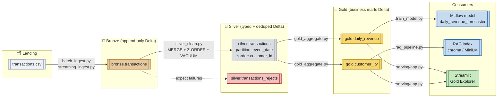

# Data lineage

Table-level lineage across the medallion layers. This mirrors what Unity
Catalog surfaces at the physical-table level, generated by hand from the
DAG definition in `orchestration/workflow.py`.

## End-to-end lineage

## Column-level lineage — `gold.daily_revenue`

Grain: `(event_date, country)`.

| Gold column          | Source                          | Transform                                       |
| -------------------- | ------------------------------- | ----------------------------------------------- |
| `event_date`         | `silver.transactions.event_date`| `to_date(event_ts)` in Silver, passthrough here |
| `country`            | `silver.transactions.country`   | passthrough                                     |
| `gross_revenue`      | `silver.transactions.revenue`   | `sum(revenue)` grouped by `(event_date, country)` |
| `order_count`        | `silver.transactions.transaction_id` | `count(transaction_id)` grouped              |
| `unique_customers`   | `silver.transactions.customer_id`    | `count_distinct(customer_id)` grouped        |

## Column-level lineage — `gold.customer_ltv`

Grain: `customer_id`.

| Gold column         | Source                          | Transform                             |
| ------------------- | ------------------------------- | ------------------------------------- |
| `customer_id`       | `silver.transactions.customer_id` | passthrough                         |
| `lifetime_revenue`  | `silver.transactions.revenue`   | `sum(revenue)` grouped by `customer_id` |
| `orders`            | `silver.transactions.transaction_id` | `count(transaction_id)` grouped   |
| `first_seen`        | `silver.transactions.event_ts`  | `min(event_ts)` grouped              |
| `last_seen`         | `silver.transactions.event_ts`  | `max(event_ts)` grouped              |

## Reject flow

Bad rows never reach Silver — they land in `silver.transactions_rejects`
with the failing expectation name and the original payload preserved. The
rejects table is append-only and queryable via Delta time travel, so you
can trend data-quality drift over time.

See `pipelines/declarative_pipeline.py` for the expectation definitions.
